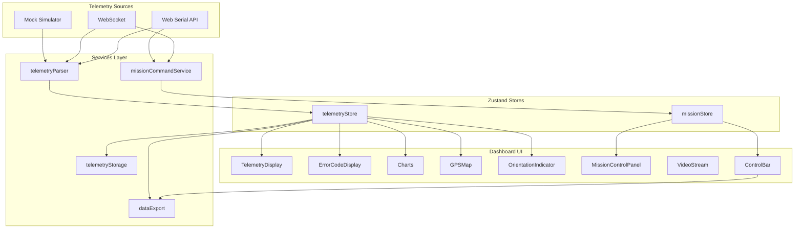
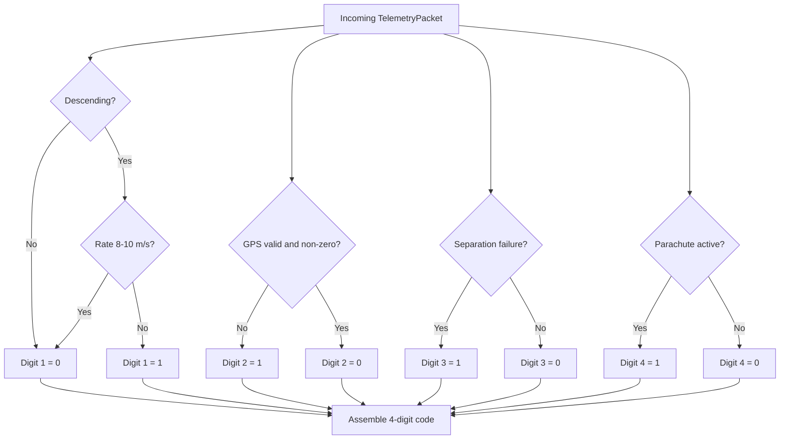

# CanSat Ground Control Software (GCS)

## Project Report

| | |
|---|---|
| **Author** | Rajarshi Ghosh |
| **GitHub** | [github.com/itsrajarshi](https://github.com/itsrajarshi) |
| **LinkedIn** | [linkedin.com/in/itsrajarshi](https://www.linkedin.com/in/itsrajarshi/) |
| **Program** | ISL / WeGyanik Internship — Aerospace Engineering, Embedded Systems, Avionics, Ground Systems |
| **Project Version** | 1.0.0 |
| **Date** | June 2026 |

---

## Abstract

This report documents the design, implementation, and validation of a single-page CanSat Ground Control Software (GCS) developed as part of an aerospace engineering internship assignment. The application provides mission operators with a real-time dashboard for monitoring telemetry from a CanSat container and payload, visualizing flight parameters, tracking GPS trajectories, detecting faults through a four-digit error code system, issuing mission-critical commands, and exporting mission data for post-flight analysis.

The GCS is implemented as a modern web application using React 18, TypeScript 5, and Vite 5, with Zustand for state management and Tailwind CSS for an aerospace-themed operator interface. Telemetry is ingested from three sources: an internal mock simulator, WebSocket, and the Web Serial API for microcontroller connectivity. Parsed data flows through a centralized store to update charts (Recharts), a Leaflet map, a Three.js attitude indicator, telemetry panels, and a live fault display. Mission commands are transmitted over serial or WebSocket using a documented ASCII protocol with ACK-based feedback.

The system satisfies all eleven requirement areas specified in the internship brief, including interface layout, control bar operations, mission control, telemetry parsing, error monitoring, real-time graphs, GPS tracking, orientation visualization, video streaming, data management, and a structured testing approach. Validation was performed through fifteen automated unit tests, eight configurable fault scenarios, and exported sample deliverables including CSV telemetry logs, graph PNGs, and UI screenshots. Future work includes recording a demonstration video and conducting extended field validation with the WeGyanik kit microcontroller.

---

## 1. Introduction

### 1.1 Background

A CanSat (Can Satellite) is a compact aerospace engineering platform used to simulate satellite and launch vehicle subsystems within the volume of a standard beverage can. During a mission, the CanSat ascends—typically under a rocket or balloon—releases a payload, descends under parachute, and transmits sensor telemetry to a ground station. The Ground Control Software (GCS) serves as the primary interface for mission operators, providing situational awareness, fault detection, and command capability throughout the flight.

Professional aerospace GCS systems prioritize readability, low cognitive load, and rapid identification of mission health. Operators must simultaneously monitor numeric telemetry, spatial position, system faults, and command status. This project implements such a system as a browser-based single-page application accessible without native installation.

### 1.2 Project Objectives

The objectives of this project were to:

1. Design and implement a professional, mission-oriented operator dashboard as a single-page web application.
2. Receive, parse, and display container and payload telemetry in real time.
3. Implement the specified four-digit error code fault monitoring system.
4. Provide real-time visualization through charts, maps, and orientation displays.
5. Enable mission-critical commands with clear status feedback.
6. Support data logging, export, and local persistence.
7. Validate the system through simulation, automated tests, and prepared submission deliverables.

### 1.3 Scope and Assumptions

The GCS targets desktop browsers with support for modern JavaScript APIs. Web Serial functionality requires Chromium-based browsers (Chrome, Edge). Video streaming uses the local machine webcam via `getUserMedia` rather than a CanSat video downlink. Chart rendering uses Recharts instead of Chart.js as suggested in the brief; both libraries provide equivalent real-time charting capability.

Hardware integration is implemented and protocol-ready; primary validation in this submission uses the mock simulator and unit tests, with Web Serial command and telemetry paths verified at the software level.

---

## 2. Background and Related Concepts

### 2.1 Ground Control Software in Aerospace Operations

Ground control software aggregates telemetry from airborne or space assets into a unified operator view. Key functions include:

- **Telemetry monitoring** — Continuous reception and display of sensor packets.
- **Fault detection** — Encoding subsystem health into concise indicators.
- **Spatial awareness** — GPS position and trajectory history.
- **Command and control** — Sending instructions to the flight vehicle with acknowledgment.
- **Data recording** — Archiving mission data for analysis and compliance.

### 2.2 Telemetry and Packet Parsing

CanSat telemetry is typically transmitted as compact ASCII strings to minimize bandwidth on serial radio links. The GCS parses comma-separated fields into structured data, validates ranges, and distributes values to UI components and storage.

### 2.3 Fault Encoding

The assignment specifies a four-digit binary error code where each digit indicates a specific subsystem condition. This design allows operators to identify multiple simultaneous faults at a glance (e.g., `1010` indicates descent rate and separation faults).

---

## 3. Requirements Analysis

The following table maps each internship brief requirement to the implementation status and primary evidence in the codebase.

| # | Requirement | Status | Implementation Summary | Key Modules |
|---|-------------|--------|------------------------|-------------|
| 1 | Interface Layout | **Met** | Single-page dashboard with telemetry, graphs, controls, map, orientation, and video sections; sticky header/footer; responsive Tailwind grid | `Dashboard.tsx`, `ControlBar.tsx`, `Footer.tsx` |
| 2 | Top Control Bar | **Met** | Start/Stop telemetry, Export CSV, Export Graph, Sync PC Time, Reset Packet; packet count and mission timer | `ControlBar.tsx` |
| 3 | Mission Control Panel | **Met** | Manual Separation, Emergency Parachute, Redundant Activation; confirmation dialogs; command lifecycle and ACK display | `MissionControlPanel.tsx`, `missionCommandService.ts` |
| 4 | Telemetry Display | **Met** | Continuous parsing; separate container and payload cards; real-time updates | `TelemetryDisplay.tsx`, `telemetryParser.ts`, `telemetryStore.ts` |
| 5 | Error Code System | **Met** | 4-digit live fault code; per-digit breakdown; green/yellow/red color coding; pulsing critical alerts | `ErrorCodeDisplay.tsx`, `calculateErrorCode()` |
| 6 | Real-Time Graphs | **Met** | Altitude, pressure, temperature, descent rate, battery voltage; live updates; PNG export | `Charts.tsx` (Recharts) |
| 7 | Tracking Map | **Met** | Leaflet + OpenStreetMap; container and payload markers; dual trajectory polylines | `GPSMap.tsx`, `telemetryStore.ts` |
| 8 | Orientation Visualization | **Met** | Roll, pitch, yaw; Three.js 3D attitude indicator and 2D artificial horizon | `OrientationIndicator.tsx`, `AttitudeIndicator3D.tsx` |
| 9 | Live Video Streaming | **Met** | Camera selection, start/stop, resolution/FPS status, fullscreen, frame capture | `VideoStream.tsx` |
| 10 | Data Management | **Met** | IndexedDB logging, full CSV export (24 columns), graph PNG export, packet reset | `telemetryStorage.ts`, `dataExport.ts` |
| 11 | Testing Strategy | **Met** | 8 mock scenarios, Web Serial API, 15 unit tests (Vitest) | `telemetrySimulator.ts`, `TelemetryScenariosPanel.tsx`, `*.test.ts` |

### 3.1 Error Code Specification

| Digit | Condition | 0 (Normal) | 1 (Fault) |
|-------|-----------|------------|-----------|
| 1 | Descent rate | 8–10 m/s while descending | Outside safe range during descent |
| 2 | GPS availability | Valid coordinates | Unavailable, invalid, or (0,0) |
| 3 | Payload separation | Separated successfully | Separation failure |
| 4 | Emergency parachute | Inactive | Activated |

**Examples:** `0000` all normal · `1000` descent fault · `0100` GPS fault · `0010` separation failure · `0001` parachute active · `1111` all faults active.

---

## 4. System Design and Architecture

### 4.1 Technology Stack

| Layer | Technology | Rationale |
|-------|------------|-----------|
| UI Framework | React 18 + TypeScript 5 | Component model, type safety, industry standard |
| Build Tool | Vite 5 | Fast development server and optimized production builds |
| Styling | Tailwind CSS 3 | Utility-first styling; consistent aerospace dark theme |
| State | Zustand 4 | Lightweight global state without boilerplate |
| Charts | Recharts 2 | React-native chart components with live data binding |
| Maps | Leaflet 1.9 + OSM | Open-source mapping with trajectory support |
| 3D Graphics | Three.js 0.155 | Hardware-accelerated attitude visualization |
| Serial I/O | Web Serial API | Direct browser-to-microcontroller communication |
| Persistence | IndexedDB | Structured local storage for up to 10,000 packets |
| Testing | Vitest 4 | Fast unit test runner integrated with Vite |

### 4.2 High-Level Architecture



### 4.3 Data Flow

1. **Ingestion** — Raw telemetry strings arrive from the selected source every 500 ms (mock) or asynchronously (serial/WebSocket).
2. **Parsing** — `parseTelemetry()` splits comma-separated fields, validates ranges, and augments missing payload fields for backward-compatible 10-field packets.
3. **Storage** — `telemetryStore.addPacket()` updates in-memory state, container GPS track, payload GPS track, and statistics.
4. **Persistence** — Each packet is asynchronously saved to IndexedDB via `telemetryStorage.savePacket()`.
5. **Rendering** — React components subscribed to the store re-render with updated values.
6. **Export** — Operators trigger CSV or PNG export from the control bar, reading accumulated packets from the store.

### 4.4 Application Layout

The dashboard (`Dashboard.tsx`) uses a full-viewport flex layout:

- **Sticky header** — Control bar with telemetry controls and export actions (`ControlBar.tsx`).
- **Scrollable main** — Telemetry panels, charts, map, orientation, mission control, and video stream.
- **Sticky footer** — Author attribution and project links (`Footer.tsx`).

### 4.5 Module Structure

```
src/
├── pages/Dashboard.tsx          Main single-page application
├── components/
│   ├── layout/                  ControlBar, Footer
│   ├── telemetry/               TelemetryDisplay, ErrorCodeDisplay, ScenariosPanel
│   ├── charts/                  Five Recharts components
│   ├── map/                     Leaflet GPS map
│   ├── orientation/             Roll/pitch/yaw display
│   ├── mission/                 Mission control panel
│   └── video/                   Webcam streaming
├── services/                    Parser, simulator, export, serial, commands
├── store/                       telemetryStore, missionStore
├── types/                       TypeScript interfaces
├── utils/                       Constants, formatters, validators
└── threejs/                     3D attitude indicator
```

---

## 5. Implementation

### 5.1 Dashboard and User Interface

The interface follows an aerospace operator aesthetic: dark background (`#050810`), cyan accent (`#00d9ff`), monospace telemetry values, and color-coded status indicators. CSS Grid and Flexbox arrange panels responsively across desktop and tablet widths.

The control bar provides:

- **Telemetry source selector** — Mock, WebSocket, or Serial (disabled if Web Serial unsupported).
- **Start / Stop Telemetry** — Initiates or halts the selected data source.
- **Reset Packet** — Clears in-memory packets, GPS tracks, IndexedDB history, and simulator state.
- **Sync PC Time** — Sends `CMD:SYNC_TIME:<unix_ms>` over active serial/WebSocket; logs locally if no connection.
- **Export CSV** — Downloads full telemetry history.
- **Export Graph** — Exports five chart PNGs (altitude, temperature, voltage, pressure, descent rate).

### 5.2 Telemetry Parsing and Display

**Packet formats:**

- **10-field base:** `packetId, missionTime, altitude, pressure, temperature, voltage, gpsLat, gpsLon, gpsAlt, descentRate`
- **21-field extended:** adds payload altitude/temperature/voltage/GPS, separation status, roll/pitch/yaw, and emergency parachute flag.

The parser (`telemetryParser.ts`) validates numeric ranges using dedicated validators (`validators.ts`) and returns structured `TelemetryPacket` objects. Warnings are logged for out-of-range values without rejecting the packet.

`TelemetryDisplay.tsx` presents two card groups:

- **Container telemetry** — Altitude, pressure, temperature, voltage, GPS coordinates, descent rate, packet count, mission time.
- **Payload telemetry** — Payload altitude, temperature, voltage, GPS, and separation status.

Fields related to active faults are highlighted when the corresponding error digit is set.

### 5.3 Error Code System

`calculateErrorCode()` evaluates four conditions on every packet:

1. **Descent rate (digit 1)** — Only evaluated during descent (negative rate). Magnitude must be 8–10 m/s.
2. **GPS (digit 2)** — Fault if coordinates are (0,0) or fail validation.
3. **Separation (digit 3)** — Uses `isSeparationFailure()` with rules for status strings, success flag, and mission elapsed time past the separation evaluation window (72 seconds in mock missions).
4. **Parachute (digit 4)** — Set when `emergencyParachuteActive` is true.

`ErrorCodeDisplay.tsx` renders the four-digit code with per-digit labels, color-coded severity (green/yellow/red), and pulsing animation for critical states.



### 5.4 Real-Time Charts

Five Recharts line charts in `Charts.tsx` subscribe to `telemetryStore.packets`:

| Chart | Field | Unit |
|-------|-------|------|
| Altitude | `altitude` | meters |
| Pressure | `pressure` | Pa |
| Temperature | `temperature` | °C |
| Descent Rate | `descentRate` | m/s |
| Battery Voltage | `voltage` | V |

Each chart supports a zoom window (last 100, 250, or 500 samples) and exports to PNG via SVG serialization (`exportSvgToPNG` in `dataExport.ts`). Animations are disabled during live updates to prevent visual lag.

### 5.5 GPS Tracking

`GPSMap.tsx` uses Leaflet with OpenStreetMap tiles. The telemetry store maintains two independent tracks:

- **Container track** — Cyan marker and dashed polyline from `gpsLatitude`/`gpsLongitude`.
- **Payload track** — Red marker and dashed polyline from `payloadGpsLatitude`/`payloadGpsLongitude`.

Points at (0,0) or invalid coordinates are excluded. The map header displays coordinates, cumulative distance, speed, and heading computed from consecutive track points.

### 5.6 Orientation Visualization

`OrientationIndicator.tsx` displays roll, pitch, and yaw in degrees from telemetry fields. Operators can toggle between:

- **3D mode** — `AttitudeIndicator3D.tsx` renders a Three.js box representing the CanSat attitude.
- **Horizon mode** — SVG artificial horizon with bank and pitch indication.

A reset button zeroes the visualization reference frame.

### 5.7 Mission Control and Command Protocol

`MissionControlPanel.tsx` provides three critical commands, each requiring confirmation:

| Command | Purpose |
|---------|---------|
| Manual Separation | Trigger payload separation |
| Emergency Parachute Deployment | Deploy recovery parachute |
| Redundant Activation | Activate backup systems |

**Command protocol** (`missionCommandService.ts`):

| Action | Outbound | Expected inbound ACK |
|--------|----------|----------------------|
| Separation | `CMD:SEPARATE\n` | `ACK:SEPARATE` |
| Parachute | `CMD:PARACHUTE\n` | `ACK:PARACHUTE` |
| Redundant | `CMD:REDUNDANT\n` | `ACK:REDUNDANT` |
| Sync time | `CMD:SYNC_TIME:<unix_ms>\n` | `ACK:SYNC_TIME` |

When Serial or WebSocket is the active telemetry source, commands are transmitted and the UI waits up to five seconds for an ACK. In mock mode, a simulated lifecycle (pending → sent → executing → ACK → completed/failed) provides operator feedback without hardware.

Command history and execution logs are retained in `missionStore` (last 100 log entries).

### 5.8 Video Streaming

`VideoStream.tsx` integrates the browser MediaDevices API:

- Enumerates available cameras.
- Starts and stops `getUserMedia` streams.
- Displays resolution and estimated FPS.
- Supports fullscreen and single-frame PNG capture.

This satisfies the brief's live video requirement using the operator workstation camera.

### 5.9 Data Management

| Feature | Implementation |
|---------|----------------|
| Telemetry logging | IndexedDB via `telemetryStorage.ts`; hydrates last 500 packets on startup |
| CSV export | 24 columns: timestamp, packetId, missionTime, errorCode, all container/payload/attitude fields |
| Graph export | Five PNG files per export action |
| Packet reset | Clears store, GPS tracks, and IndexedDB |
| JSON export | API available in `dataExport.ts` (no UI button) |

Sample export: `deliverables/samples/exports/csv/cansat-telemetry_2026-06-07_18-26-00.csv`

### 5.10 Mock Simulator

`telemetrySimulator.ts` generates realistic mission profiles over a 180-second mock mission:

**Stages:** launch → ascent → apogee → separation → descent → landing

**Scenarios** (`scenarioCatalog.ts`):

| Scenario | Expected fault pattern |
|----------|------------------------|
| Normal Mission | `0000`, parachute near landing |
| GPS Failure | `0100` during outage |
| Separation Failure | `0010` after separation window |
| Parachute Deployment | `0001` when chute active |
| Descent Rate Fault | `1000` during descent |
| Battery Failure | Voltage sag (not in error code) |
| Sensor Failure | Erratic sensor readings |
| Packet Loss | Simulated dropouts |

`TelemetryScenariosPanel.tsx` allows scenario selection and single-packet preview before starting live mock telemetry.

---

## 6. Testing and Validation

### 6.1 Automated Unit Tests

Fifteen unit tests run via `npm test` (Vitest):

| Test File | Coverage |
|-----------|----------|
| `telemetryParser.test.ts` | 10-field and 21-field parsing, rejection of invalid packets, all error code combinations, descent-only digit 1, separation timing |
| `telemetrySimulator.test.ts` | Distinct error codes per scenario at preview progress |
| `missionCommandService.test.ts` | Command string formatting, ACK line recognition |
| `dataExport.test.ts` | CSV includes container, payload, and error code columns |

All tests pass in the project build pipeline.

### 6.2 Manual Test Cases

| Feature | Test Steps | Expected Result | Status |
|---------|------------|-----------------|--------|
| Mock telemetry | Select Mock → Start Telemetry | Charts, map, and telemetry update every 500 ms | Pass |
| GPS failure scenario | Select GPS Failure → preview packet | Error code digit 2 = 1 | Pass |
| Descent rate fault | Select Descent Rate Fault → run mission | Digit 1 = 1 during descent | Pass |
| CSV export | Run mission → Export CSV | 24-column file downloads | Pass |
| Graph export | Run mission → Export Graph | Five PNG files download | Pass |
| Packet reset | Reset Packet | Counters zero; charts clear | Pass |
| Map dual track | Run separation scenario | Container and payload tracks diverge | Pass |
| Mission command (mock) | Execute Manual Separation | Status lifecycle completes | Pass |
| Video stream | Start Camera → Stop Camera | Live feed with status | Pass |
| Web Serial connect | Select Serial → Start (with device) | Telemetry parses from serial lines | Ready |

### 6.3 Web Serial Integration

`webSerialService.ts` implements:

- Port selection via `navigator.serial.requestPort()`
- Connection at 9600 baud
- Line-buffered reading (newline-delimited)
- `send()` for outbound commands
- ACK line filtering before telemetry parsing

Hardware validation with the WeGyanik kit microcontroller is supported at the protocol level; the microcontroller firmware should respond to `CMD:*` messages with `ACK:*` and transmit comma-separated telemetry lines.

---

## 7. Results and Demonstration

### 7.1 Screenshots

The following screenshots are included in `deliverables/screenshots/`:

| Figure | File | Description |
|--------|------|-------------|
| 1 | main dashboard.png | Full dashboard layout with sticky header, telemetry panels, and footer |
| 2 | live telemetry.png | Container and payload telemetry cards with live values |
| 3 | error code system.png | Four-digit fault display with color-coded digit breakdown |
| 4 | graphs.png | Five real-time charts during mock mission |
| 5 | GPS tracking.png | Leaflet map with container (cyan) and payload (red) trajectories |
| 6 | orientations, emergency buttons and camera.png | Orientation visualization, mission control buttons, and video panel |

### 7.2 Export Samples

A normal mock mission was recorded on 7 June 2026:

- **CSV:** `deliverables/samples/exports/csv/cansat-telemetry_2026-06-07_18-26-00.csv`
- **Graphs:** Five PNG files in `deliverables/samples/exports/graphs/` (altitude, temperature, voltage, pressure, descent rate)

### 7.3 Demonstration Video

A walkthrough video covering dashboard operation, scenario testing, and data export is available at `deliverables/demo/DEMO_VIDEO.MP4`.

---

## 8. Challenges and Solutions

### 8.1 Real-Time UI Performance

**Challenge:** Updating five charts, a map, telemetry cards, and error display every 500 ms risks frame drops.

**Solution:** Zustand provides selective subscriptions; chart animations are disabled during live mode; packet history is capped at 500 samples to bound memory and render cost.

### 8.2 Serial Line Buffering

**Challenge:** Web Serial delivers arbitrary byte chunks, not complete telemetry lines.

**Solution:** `webSerialService.ts` accumulates data in a line buffer, splitting on `\n` and trimming before passing complete lines to the parser.

### 8.3 Error Code Edge Cases

**Challenge:** Descent rate should not fault during ascent; separation should not fault before the separation window.

**Solution:** Digit 1 checks `isDescendingPhase()`; digit 3 uses `isSeparationFailure()` with status string, success flag, and elapsed mission time thresholds.

### 8.4 Chart Library Selection

**Challenge:** The brief suggests Chart.js; the implementation uses Recharts.

**Solution:** Recharts integrates natively with React's component model and supports the required live line charts and SVG-based PNG export. Functionality is equivalent for assignment purposes.

### 8.5 Dual GPS Tracking

**Challenge:** Container and payload GPS diverge after separation; a single track is insufficient.

**Solution:** `telemetryStore.ts` maintains separate `gpsTrack` and `payloadGpsTrack` arrays, rendered as distinct markers and polylines on the map.

---

## 9. Conclusion and Future Work

### 9.1 Conclusion

This project successfully delivers a professional CanSat Ground Control Software meeting all eleven requirements of the internship assignment. The single-page dashboard provides real-time telemetry monitoring, fault detection through a four-digit error code system, mission command capability, comprehensive visualization, and data export functionality.

The modular architecture—separating parsing, state, services, and UI—supports maintainability and future extension. Automated tests validate core parsing, error logic, command formatting, and export completeness. Submission deliverables including screenshots, CSV samples, and graph exports demonstrate end-to-end system operation.

### 9.2 Future Work

1. **Demonstration video** — Record and publish a full mission walkthrough.
2. **Hardware field testing** — Validate end-to-end with the WeGyanik microcontroller over Web Serial.
3. **Firmware alignment** — Document shared command/ACK protocol for Arduino sketch integration.
4. **CI pipeline** — Add GitHub Actions for automated test runs on push.
5. **Component tests** — Extend coverage to React UI components.
6. **CanSat video downlink** — Integrate RTP or MJPEG stream if hardware supports it.

---

## 10. References

1. MDN Web Docs — Web Serial API: https://developer.mozilla.org/en-US/docs/Web/API/Web_Serial_API  
2. MDN Web Docs — WebSocket API: https://developer.mozilla.org/en-US/docs/Web/API/WebSocket  
3. MDN Web Docs — MediaDevices.getUserMedia: https://developer.mozilla.org/en-US/docs/Web/API/MediaDevices/getUserMedia  
4. Leaflet.js Documentation: https://leafletjs.com/reference.html  
5. Three.js Documentation: https://threejs.org/docs/  
6. Recharts Documentation: https://recharts.org/en-US/  
7. Chart.js Documentation: https://www.chartjs.org/docs/latest/  
8. React Documentation: https://react.dev/  
9. Vite Documentation: https://vitejs.dev/  
10. OpenStreetMap: https://www.openstreetmap.org/

---

## Appendix A: How to Run

```bash
# Install dependencies
npm install

# Development server (http://localhost:5173)
npm run dev

# Run unit tests
npm test

# Production build (output in dist/)
npm run build

# Preview production build
npm run preview
```

**Environment variables** (optional):

- `VITE_WEBSOCKET_URL` — WebSocket endpoint for live telemetry

---

## Appendix B: Key File Index

| File | Purpose |
|------|---------|
| `src/pages/Dashboard.tsx` | Main application page and telemetry source orchestration |
| `src/components/layout/ControlBar.tsx` | Top control bar |
| `src/components/layout/Footer.tsx` | Sticky footer with author links |
| `src/components/telemetry/TelemetryDisplay.tsx` | Container and payload telemetry cards |
| `src/components/telemetry/ErrorCodeDisplay.tsx` | Four-digit error code UI |
| `src/components/telemetry/TelemetryScenariosPanel.tsx` | Mock scenario selector |
| `src/components/charts/Charts.tsx` | Five real-time charts |
| `src/components/map/GPSMap.tsx` | Leaflet GPS map |
| `src/components/orientation/OrientationIndicator.tsx` | Attitude display |
| `src/threejs/AttitudeIndicator3D.tsx` | Three.js 3D model |
| `src/components/mission/MissionControlPanel.tsx` | Mission commands |
| `src/components/video/VideoStream.tsx` | Webcam streaming |
| `src/services/telemetryParser.ts` | Packet parsing and error code logic |
| `src/services/telemetrySimulator.ts` | Mock telemetry generator |
| `src/services/missionCommandService.ts` | Command protocol |
| `src/services/webSerialService.ts` | Web Serial API wrapper |
| `src/services/dataExport.ts` | CSV and PNG export |
| `src/services/telemetryStorage.ts` | IndexedDB persistence |
| `src/store/telemetryStore.ts` | Telemetry state and GPS tracks |
| `src/store/missionStore.ts` | Mission commands and logs |

---

## Submission Checklist

- [x] Source code complete
- [x] UI screenshots (6)
- [x] CSV export sample
- [x] Graph PNG samples (5)
- [x] Project report (`docs/PROJECT_REPORT.md`)
- [x] Demonstration video → `deliverables/demo/DEMO_VIDEO.MP4`
- [x] Export report to PDF (if required by evaluator)
- [x] Final git commit and push

---

*Report prepared by Rajarshi Ghosh — June 2026*
